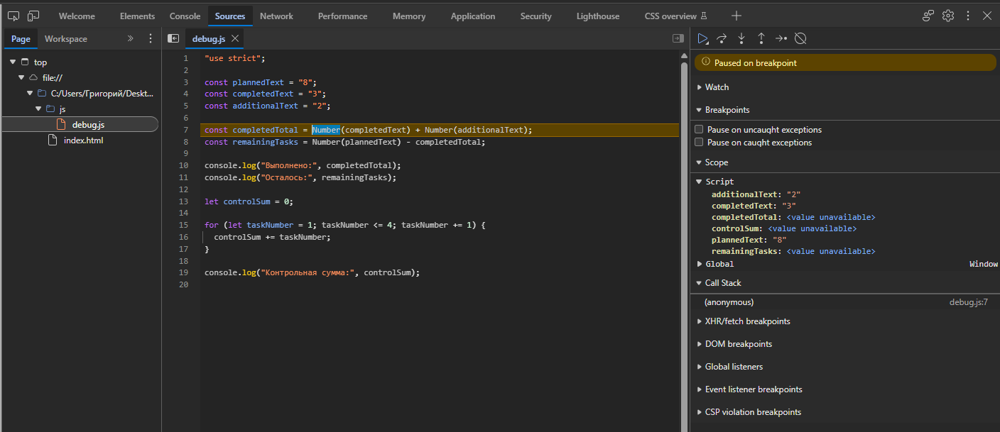

# Отчёт по практической работе № 1

**Тема:** Подготовка окружения и первые программы на JavaScript

## 1. Автор и вариант

- **ФИО:** Соколов Григорий Александрович
- **Группа:** ЭФБО-12-25
- **Номер в журнале:** 18
- **Вариант:** `((18 - 1) % 8) + 1 = 2`
- **Данные варианта:** `totalTasks = 15`, `completedTasks = 0`, `dailyLimit = 4`

## 2. Окружение

| Компонент | Версия |
|---|---|
| ОС | Windows |
| Node.js | v24.19.0 |
| npm | ВПИСАТЬ (`npm --version`) |
| Git | ВПИСАТЬ (`git --version`) |
| Браузер | ВПИСАТЬ (например, Google Chrome) |

## 3. Запуск

Команды выполняются из корня репозитория:

```bash
node practice-01/js/hello.js
node practice-01/js/types.js
node practice-01/js/progress.js
node practice-01/js/plan.js
node practice-01/js/debug.js
```

В браузере: открыть `practice-01/index.html`, в теге `script` поменять путь на нужный файл
(например `./js/types.js`), сохранить, обновить страницу и открыть DevTools → Console.
Сейчас в `index.html` подключён `./js/hello.js`.

## 4. Задание 1. Один файл — две среды

Файл `hello.js` запускался через `node` в терминале и через `index.html` в браузере.

| Где запускал | Где появился вывод | `typeof document` |
|---|---|---|
| Node.js | В терминале | `undefined` |
| Браузер | В DevTools → Console (на самой странице вывода нет) | `object` |

Первые четыре строки одинаковые. Отличается только последняя: в браузере есть объект `document`
(это страница, DOM), а в Node.js страницы нет, поэтому `document` не определён.

## 5. Задание 2. Типы и преобразования

| Выражение | Ожидание до запуска | Фактическое значение | Тип результата | Объяснение |
|---|---|---|---|---|
| `"8" + 2` | `"82"` | `82` | string | `+` со строкой склеивает текст, 2 превращается в "2" |
| `"8" - 2` | `6` | `6` | number | Для строк `-` нет, поэтому "8" переводится в число |
| `Number("8") + 2` | `10` | `10` | number | Сначала явно получили число 8, потом обычное сложение |
| `"12" > "3"` | `false` | `false` | boolean | Строки сравниваются посимвольно: "1" меньше "3" |
| `12 === "12"` | `false` | `false` | boolean | Строгое сравнение не приводит типы, number ≠ string |
| `Number("")` | `0` | `0` | number | Пустая строка превращается в 0 — поэтому Number() не проверка ввода |
| `Number("text")` | `NaN` | `NaN` | number | Текст не число, получается NaN, но тип у NaN — number |
| `Boolean("false")` | `true` | `true` | boolean | Любая непустая строка даёт true, текст внутри не важно |
| `typeof null` | `"object"` | `object` | string | Старая особенность JS; сам результат typeof — всегда строка |
| `typeof NaN` | `"number"` | `number` | string | NaN — особое числовое значение; результат typeof — строка |

## 6. Задание 3. Сводка выполнения задач (`progress.js`)

Порядок проверок в коде: сначала тип (число), потом NaN/Infinity, потом целое ли,
потом отрицательное, потом верхняя граница 1000, потом выполнено ≤ всего, потом случай «0 задач».
Статус считается по исходным числам, а не по округлённому проценту.

| Проверка | Входные данные | Ожидаемый результат | Фактический результат | Итог |
|---|---|---|---|---|
| Мой вариант | `15, 0` | Осталось 15; 0.0%; «Не начато» | Осталось: 15; Прогресс: 0.0%; Статус: Не начато | Пройдено |
| Обычный | `12, 5` | Осталось 7; 41.7%; «В работе» | Осталось: 7; Прогресс: 41.7%; Статус: В работе | Пройдено |
| Нет задач | `0, 0` | «Задач пока нет» | Задач пока нет | Пройдено |
| Не начато | `5, 0` | Осталось 5; 0.0%; «Не начато» | Осталось: 5; Прогресс: 0.0%; Статус: Не начато | Пройдено |
| Всё сделано | `5, 5` | Осталось 0; 100.0%; «Завершено» | Осталось: 0; Прогресс: 100.0%; Статус: Завершено | Пройдено |
| Выполнено больше | `5, 6` | Ошибка | Ошибка: выполнено больше задач, чем существует. | Пройдено |
| Отрицательное | `-1, 0` | Ошибка | Ошибка: количество задач не может быть отрицательным. | Пройдено |
| Дробное | `5, 2.5` | Ошибка | Ошибка: количество задач должно быть целым числом. | Пройдено |
| Строка | `"5", 2` | Ошибка | Ошибка: количество задач должно быть числом, а не строкой или другим типом. | Пройдено |
| Больше 1000 | `1001, 0` | Ошибка | Ошибка: общее количество задач превышает верхнюю границу 1000. | Пройдено |
| NaN | `NaN, 0` | Ошибка | Ошибка: недопустимое числовое значение (NaN или Infinity). | Пройдено |

## 7. Задание 4. План по дням (`plan.js`)

Используется цикл `while`: пока остались задачи, увеличиваю номер дня, беру
`Math.min(dailyLimit, remainingTasks)` задач и уменьшаю остаток. Так в последний день
не получается сделать больше, чем осталось, и остаток не уходит в минус.
Если данные неверные, цикл не запускается.

Вывод для моего варианта `15, 0, 4`:

```text
Осталось задач: 15
День 1: выполнено 4, осталось 11
День 2: выполнено 4, осталось 7
День 3: выполнено 4, осталось 3
День 4: выполнено 3, осталось 0
Потребуется дней: 4
```

| Проверка | Входные данные | Ожидаемый результат | Фактический результат | Итог |
|---|---|---|---|---|
| Мой вариант | `15, 0, 4` | 4 дня, в последний 3 задачи | 4 дня: 4, 4, 4, 3 | Пройдено |
| Общий пример | `12, 5, 3` | 3 дня, в последний 1 задача | 3 дня: 3, 3, 1 | Пройдено |
| Ровно делится | `10, 4, 3` | 2 дня по 3 | 2 дня: 3, 3 | Пройдено |
| Лимит больше остатка | `5, 3, 10` | 1 день, 2 задачи | 1 день: 2 | Пройдено |
| Всё сделано | `5, 5, 2` | 0 дней | Все задачи уже выполнены; Потребуется дней: 0 | Пройдено |
| Нет задач | `0, 0, 2` | 0 дней | Все задачи уже выполнены; Потребуется дней: 0 | Пройдено |
| Лимит 0 | `5, 2, 0` | Ошибка | Ошибка: дневная норма должна быть от 1 до 1000. | Пройдено |
| Дробный лимит | `5, 2, 1.5` | Ошибка | Ошибка: дневная норма должна быть целым числом. | Пройдено |
| Выполнено больше | `5, 6, 2` | Ошибка | Ошибка: некорректное число выполненных задач (больше общего количества). | Пройдено |
| Лимит строкой | `5, 2, "2"` | Ошибка | Ошибка: дневная норма должна быть числом, а не строкой. | Пройдено |
| Лимит 1001 | `5, 2, 1001` | Ошибка | Ошибка: дневная норма должна быть от 1 до 1000. | Пройдено |

## 8. Задание 5. Отладка (`debug.js`)

Исходный вывод (до исправления):

```text
Выполнено: 32
Осталось: -24
Контрольная сумма: 6
```

Вывод после исправления:

```text
Выполнено: 5
Осталось: 3
Контрольная сумма: 10
```

Точка останова ставилась на строке с `completedTotal` (DevTools → Sources), там видно,
что `completedText` и `additionalText` — строки. Вторая точка — внутри цикла `for`.



| Ошибка | Что наблюдалось | Причина | Исправление | Результат после исправления |
|---|---|---|---|---|
| Обработка количества задач | `completedTotal` = "32" (строка), осталось -24 | `+` склеил строки "3" и "2" | `Number(completedText) + Number(additionalText)` | Выполнено: 5, Осталось: 3 |
| Граница цикла | Сумма 6, цикл остановился на `taskNumber = 3` | Условие `< 4` не включает 4 | Условие `<= 4` | Контрольная сумма: 10 |

## 9. Вывод

Научился запускать один и тот же JS-файл в Node.js и в браузере, проверять входные данные
(тип → целое → диапазон) и писать цикл `while`, который точно заканчивается.
Самая показательная ошибка — склейка строк через `+`: программа не падает, но считает неправильно,
и это видно только при проверке значений в отладчике.
