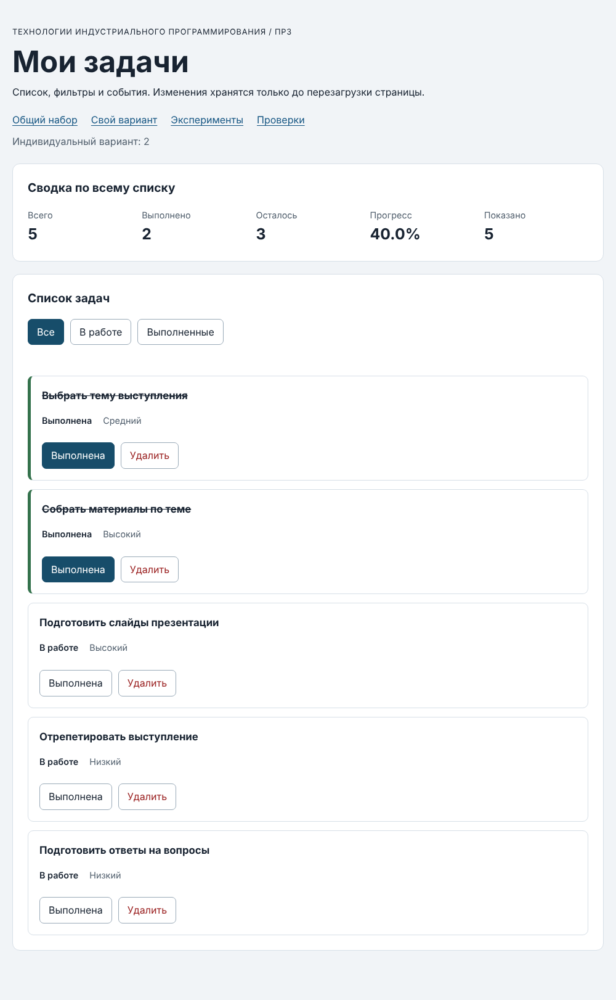

# Отчёт по практической работе № 3

**Тема:** Работа с DOM и событиями

## 1. Данные работы

| Поле | Значение |
|---|---|
| ФИО | Соколов Григорий Александрович |
| Группа | ЭФБО-12-25 |
| Вариант из ПР2 | 2 (подготовка выступления) |
| Node.js | v24.19.0 |
| Браузер | ВПИСАТЬ (название и версия) |
| ОС | Windows |

## 2. Запуск

Рабочая папка — `practice-03`:

```bash
cd practice-03
npm run check:service
npm start
```

`npm install` не нужен. Если PowerShell блокирует `npm`, можно `npm.cmd start` или `node tools/serve.mjs`.

Адреса после запуска сервера:

```text
http://127.0.0.1:5503/                          — общий набор
http://127.0.0.1:5503/index.html?dataset=variant — мой вариант
http://127.0.0.1:5503/examples/dom-events.html  — эксперименты
http://127.0.0.1:5503/checks.html               — браузерные проверки
```

Остановить сервер — `Ctrl+C`.

## 3. Что перенесено из ПР2

`src/task-service.js` и `src/data.js` скопированы из `practice-02/src` без изменений.
Повторная проверка `npm run check:service` — 35 из 35.

## 4. Эксперименты (examples/dom-events.html)

| № | Прогноз | Фактический результат | Объяснение |
|---:|---|---|---|
| 1 | `null` и длина 0 | `Отсутствующий элемент: null`, `Пустая коллекция: 0` | `querySelector` без совпадений даёт `null` (у него нельзя брать свойства), `querySelectorAll` — пустой NodeList |
| 2 | `"23"` строка, потом число 23 | `dataset.taskId: 23 string`, `Числовой id: 23` | В `dataset` всегда строки, число получаем через `Number` |
| 3 | Старый NodeList 1, новый растёт | Старый: 1 и 1; новый `querySelectorAll`: 2, потом 3 | `querySelectorAll` возвращает «снимок» на момент вызова, он сам не обновляется |
| 4 | Текст с `<strong>` без жирного | Заголовок: `<strong>Это текст, а не HTML</strong>`, элементов `strong` внутри 0 | `textContent` вставляет текст, а не разметку |
| 5 | Захват на карточке, потом кнопка, потом карточка | `1. phase=1; target=lab-label; currentTarget=lab-card`<br>`2. phase=3; target=lab-label; currentTarget=lab-button`<br>`3. phase=3; target=lab-label; currentTarget=lab-card` | `target` — где реально кликнули (span), `currentTarget` — чей обработчик сейчас работает. Событие всплывает от span к кнопке и к карточке |

Поэтому обработчик на общем контейнере (`ul`) получает клики по кнопкам внутри карточек — на этом
и построено делегирование.

## 5. Распределение по модулям

- `data.js` — наборы задач и номер варианта;
- `task-service.js` — функции ПР2 (без `document`);
- `task-selectors.js` — `getVisibleTasks`: отбор по фильтру all / pending / completed;
- `task-view.js` — создание карточек, отрисовка списка, сводки и пустого состояния;
- `main.js` — текущее состояние (`currentTasks`, `currentFilter`) и обработчики кликов.

Сводка всегда считается по всему `currentTasks`, а «Показано» — по видимой выборке.
Обработчики назначаются один раз на `#task-list` и `#task-filters`, при перерисовке меняются только карточки.

## 6. Общий сценарий

| Шаг | Действие, фильтр | Ожидание (id; всего/вып./ост.; %) | Фактический результат | Итог |
|---:|---|---|---|---|
| 0 | Исходный, «Все» | [1,4,7,10]; 4/2/2; 50.0% | [1,4,7,10]; 4/2/2; 50.0%; показано 4 | Пройдено |
| 1 | «В работе» | [4,7]; 4/2/2; 50.0% | [4,7]; 4/2/2; 50.0%; показано 2 | Пройдено |
| 2 | Выполнить id 4 | [7]; 4/3/1; 75.0% | [7]; 4/3/1; 75.0%; показано 1 | Пройдено |
| 3 | «Все» | [1,4,7,10]; 4/3/1; 75.0% | [1,4,7,10]; 4/3/1; 75.0% | Пройдено |
| 4 | Удалить id 7 | [1,4,10]; 3/3/0; 100.0% | [1,4,10]; 3/3/0; 100.0% | Пройдено |
| 5 | «В работе» | []; 3/3/0; 100.0% | []; 3/3/0; 100.0%; «Нет задач по выбранному фильтру.» | Пройдено |
| 6 | «Все», переключить id 1 | [1,4,10]; 3/2/1; 66.7% | [1,4,10]; 3/2/1; 66.7% | Пройдено |
| 7 | Удалить 1, 4, 10 | []; 0/0/0; 0.0% | []; 0/0/0; 0.0%; «Список задач пуст.» | Пройдено |

После перезагрузки страницы снова шаг 0 — сохранения в ПР3 нет, так и должно быть.

**Проверка ошибок через Elements:** у карточки id 4 поменял `data-task-id` на `777` →
«Ошибка: задача не найдена.», данные не изменились. На `4abc` → «Ошибка: некорректный id задачи.»
(`Number("4abc")` даёт `NaN`, а не 4). Клик по названию задачи ничего не меняет.

## 7. Отладка

Точка останова в `handleTaskListClick` на строке `const id = Number(card.dataset.taskId);`.
При нажатии «Выполнена» у задачи id 4: `card.dataset.taskId` = `"4"` (string), после `Number` — `4` (number),
`action` = `"toggle"`, `findTaskById` вернул `{ id: 4, title: "Подготовить модель задач", completed: false, priority: "high" }`.
На следующей остановке после `setTaskCompleted`: `result.ok = true`, в `result.tasks` у id 4 `completed: true`,
это новый массив, потом `renderApp()` перерисовывает список.

## 8. Индивидуальный вариант

Адрес: `index.html?dataset=variant`, подпись «Индивидуальный вариант: 2».

| Шаг | Ожидание | Фактический результат | Итог |
|---|---|---|---|
| Исходный | 6 задач; 6/1/5; 16.7% | [11,23,37,41,58,64]; 6/1/5; 16.7% | Пройдено |
| «В работе» | 5 задач | [23,37,41,58,64] | Пройдено |
| «Выполненные» | 1 задача | [11] | Пройдено |
| «Все», переключить id 23 | 6/2/4; 33.3% | 6/2/4; 33.3% | Пройдено |
| Удалить id 37 | [11,23,41,58,64]; 5/2/3; 40.0% | [11,23,41,58,64]; 5/2/3; 40.0% | Пройдено |
| Итог по фильтрам | В работе [41,58,64], выполненные [11,23] | В работе [41,58,64], выполненные [11,23] | Пройдено |

Приоритеты и названия остальных задач не изменились.



## 9. Проверки

**Сервис (`npm run check:service`):**

```text
OK: 01. Создание задачи с явным приоритетом
OK: 02. Приоритет по умолчанию
OK: 03. Удаление краевых пробелов без изменения внутренних
OK: 04. Граничные длины названия и положительный безопасный id
OK: 05. Некорректные названия при создании
OK: 06. Некорректные идентификаторы при создании
OK: 07. Все допустимые приоритеты и отклонение недопустимых
OK: 08. Каждый вызов createTask возвращает новый объект
OK: 09. Поиск по id, а не по индексу
OK: 10. Отсутствующая задача и пустой массив при поиске
OK: 11. Поиск не преобразует строковый id в число
OK: 12. Получение невыполненных задач
OK: 13. Пустой список, все выполнены и все не выполнены
OK: 14. Названия в исходном порядке и пустой список
OK: 15. Сводка по общему набору
OK: 16. Сводка по пустому списку
OK: 17. Сводка: ничего не выполнено и выполнено всё
OK: 18. Процент остаётся числом без предварительного округления
OK: 19. Добавление в конец без изменения входного массива
OK: 20. Добавление в пустой список с приоритетом по умолчанию
OK: 21. Повторяющийся id отклоняется
OK: 22. Добавление не обходит проверки createTask
OK: 23. Изменение completed в обе стороны
OK: 24. completed принимает только boolean
OK: 25. Некорректный или отсутствующий id при изменении статуса
OK: 26. Повторная установка статуса создаёт новый результат
OK: 27. Переименование сохраняет остальные поля
OK: 28. Проверки названия при переименовании
OK: 29. Некорректный или отсутствующий id при переименовании
OK: 30. Удаление по id с сохранением порядка
OK: 31. Удаление единственной записи
OK: 32. Некорректный, отсутствующий id и удаление из пустого списка
OK: 33. Входные объекты не изменяются ни одной операцией
OK: 34. Общий сценарий и все промежуточные сводки
OK: 35. Работа с другим набором, без зависимости от demoTasks
Проверок пройдено: 35; не пройдено: 0.
```

**Браузер (`checks.html`), текстовый протокол:**

```text
OK: Фильтр all возвращает новый массив в исходном порядке
OK: Фильтр pending выбирает невыполненные задачи
OK: Фильтр completed выбирает выполненные задачи
OK: Все три фильтра работают с пустым списком
OK: Фильтрация не меняет входные записи и их порядок
OK: Карточка — li.task-card с числовым id в dataset
OK: Статус невыполненной карточки и aria-pressed согласованы
OK: Статус выполненной карточки и aria-pressed согласованы
OK: В карточке две обычные кнопки с вложенными подписями
OK: Все приоритеты отображаются по установленному словарю
OK: Название с разметкой отображается текстом
OK: Отрисовка списка создаёт карточки в исходном порядке
OK: Повторная отрисовка не накапливает карточки
OK: Контейнер списка и его обработчик сохраняются
OK: Отрисовка пустого массива очищает прежние карточки
OK: Сводка считается по всему списку, отдельно выводится Показано
OK: Пустая сводка не содержит NaN и Infinity
OK: Сообщение для полностью пустого списка
OK: Сообщение для пустого результата фильтра
OK: Появление карточек скрывает прежнее пустое состояние
OK: Приложение: начальный набор и сводка
OK: Приложение: фильтр срабатывает по клику на вложенный span
OK: Приложение: активный фильтр отмечен классом и aria-pressed
OK: Приложение: фильтрация не удаляет скрытые задачи
OK: Приложение: переключение по id, а не индексу массива
OK: Приложение: выполненная задача исчезает из фильтра В работе
OK: Приложение: удаление изменяет данные, а не только DOM
OK: Приложение: клик по названию не изменяет данные
OK: Приложение: после перерисовок одно нажатие — одно изменение
OK: Приложение: удаление всех записей и нулевая сводка
OK: Приложение: нет совпадений — не то же самое, что нет задач
OK: Приложение: неизвестный числовой id не меняет данные
OK: Приложение: id 4abc не превращается в 4
OK: Приложение: неизвестное действие игнорируется
OK: Приложение: после изменения сохраняется клавиатурный фокус
OK: Приложение: новая загрузка возвращает исходное состояние
Всего: 36. Пройдено: 36. Ошибок: 0.
```

## 10. Собственные проверки

| Проверка | Исходное состояние и действие | Ожидание | Фактический результат | Итог |
|---|---|---|---|---|
| Несколько быстрых нажатий | Общий набор, 5 раз «Выполнена» у id 10 | Нечётное число → id 10 станет «В работе», выполнено 1, 25.0% | выполнено 1; 25.0%; показано 4 | Пройдено |
| Действие после смены фильтров | «Выполненные» → «В работе» → «Выполненные», снять отметку с id 1 | id 1 пропадает из «Выполненных», в «В работе» становится [1,4,7]; фильтр остаётся выбранным | Выполненные: [10]; В работе: [1,4,7]; активный фильтр pending | Пройдено |
| Название из 100 символов | `createTaskElement` с title из 100 букв | Название выводится полностью | длина текста 100, «Низкий», «В работе» | Пройдено |
| Одна задача (граница) | Вариант, удалить всё кроме id 64, затем отметить её | 1/0/1 0.0%, потом 1/1/0 100.0% | 0.0% → 100.0%, показано 1 | Пройдено |

## 11. Расширение

Не выполнялось.

## 12. Вывод

Подключил функции ПР2 к странице: карточки создаются через DOM-методы, название выводится через
`textContent`, клики обрабатываются одним обработчиком на списке (делегирование через `closest`).
Данные меняются только через функции ПР2, а интерфейс каждый раз перерисовывается из массива.
Главное понял про `target` и `currentTarget` и про то, что id из `dataset` — строка, его нужно переводить в число.
